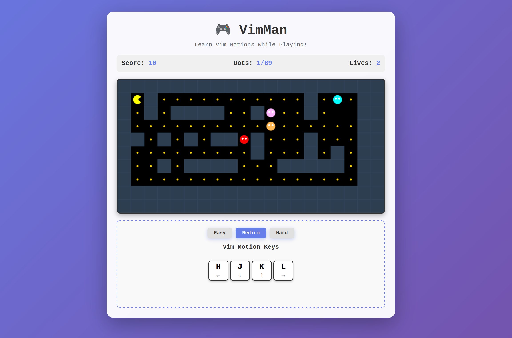

# VimMan - Pacman-style game to turn `hjkl` into muscle memory

Vim is an amazing tool for productivity, but some parts are hard to learn. Replacing the arrow keys for movement requires ignoring the reflexes built up from decades of PC-gaming.

To fight fire with fire, this browser-based pacman-style game helps you learn `hjkl` in a fun, frantic and addictive way.

## Development Note

This is a weekend project for exploring AI-assisted coding tools and testing the new Anthropic models, while creating something that helps me and others finally turn vim motions into muscle memory.

